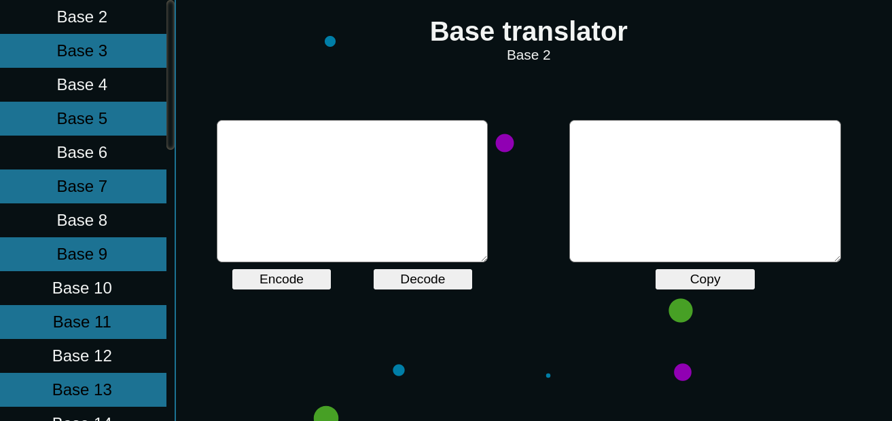

<div align="center">
    <h1>Base converter</h1>
    
</div>

# What's that
Base converter is a web application that translate characters from/to specific base, the bases can be between 2 and 36, that are the bases commonly accessed using A-z + 0-9. This website uses a tiny library called as Bubble background, this make the bubble effect in background.

# Pressing the play
First of all, the project was uploaded to Github without node_modules, then you should download all dependencies with NPM or another package manager that you have in your machine. after it, some scripts is already created in project, then if you're using NPM you could start the server by just executing the following command on terminal:
```sh
npm start
```

# Final warnings
The project's server was made in Typescript, transpiling it to Javascript could be useful for production time, but the ts-node is already a development dependency.